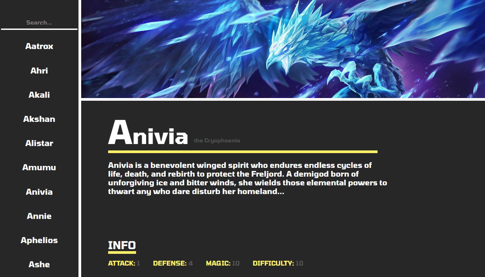

<h1>Champion Documentation</h1>
 This is a solution to the

[freeCodeCamp "Build a Tribute Page" challenge.](https://www.freecodecamp.org/learn/responsive-web-design/responsive-web-design-projects/build-a-technical-documentation-page).

freeCodeCamp is a non-profit organization that consists of an interactive learning web platform, an online community forum, chat rooms, online publications and local organizations that intend to make learning web development accessible to anyone.

<!-- REPLACE HREFS -->

<h2>Overview</h2>

I decided to take a little spin on the initial challenge.

I wanted to create something using an API and as a fan of Riot games, decided a little champion documentation would be fitting.

The design and overall feel of the project is not pe

